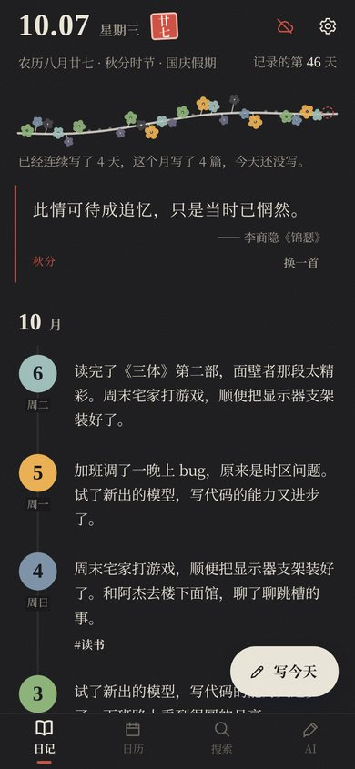
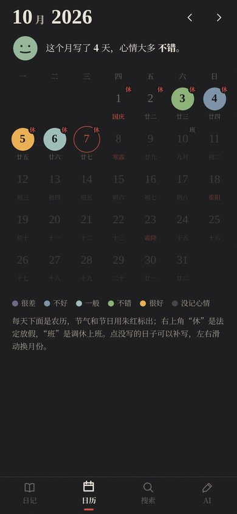
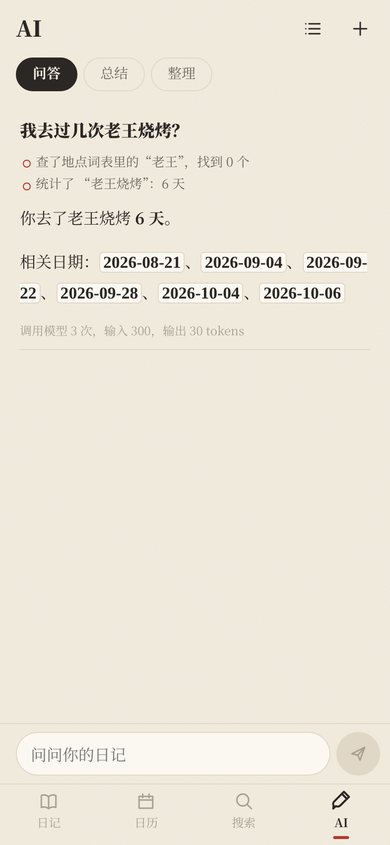

# 浮生记

一个安卓日记 app：日记就是手机上的普通 Markdown 文件，可选同步到阿里云 OSS 或 GitHub 私有仓库，可以接入任意大模型，对全部日记提问、写月度和年度总结。界面是“宣纸水墨”风格，带农历、节气、法定节假日和每日诗词。

全部代码由 AI 编写。你可以直接下载打包好的 APK，也可以 fork 之后让 AI 按你的想法继续改，推送后 GitHub 会自动打包。

<p>
  
  
  
  
</p>

## 特点

- **数据不被锁在 app 里**：一天一个 `.md` 文件（YAML 头 + Markdown 正文），离开这个 app，用 Obsidian、Typora 或任何脚本都能读。格式说明见 [SPEC.md](SPEC.md) 第 4 节。
- **写一篇的成本很低**：打开就能写；当天第一次写时自动记录位置和天气；同一天再写会追加一个 `### HH:mm` 段落。
- **AI 能数清楚次数**：问“过去一年去过几次老王烧烤”时，模型负责找出这个地方的各种写法，计数在代码里完成，并列出对应的日期，不靠模型自己数。
- **所有云服务都是可选的**：什么都不配，它就是一个纯本地的日记本。
- **隐私**：密钥只加密存在手机上；云端备份可以按后端单独开启加密（[age](https://age-encryption.org) 格式，电脑上也能解开）；单篇日记可以设为“不让 AI 读”。

## 功能一览

**写作**
- 心情拖动条（5 档），标签、提到的人、去过的地方
- 位置（高德附近地点）和天气，当天自动记录，往日可补写
- 插图（拍照或相册），图片可配一句说明，也可让 AI 看图写
- 编辑快捷栏：加粗、列表、编号、待办、引用、时间标题、插图、撤销；列表回车自动续行
- 已写过的日记默认是阅读视图，待办可直接勾选
- 长按桌面图标有“写今天”快捷方式
- 删除的日记进“最近删除”，保留 30 天

**回顾**
- 首页：最近 30 天画成一枝梅花，写一天开一朵，花色是当天心情；那年今日；每日诗词（内置诗词库，可选联网的今日诗词）
- 日历：心情色块、农历、节气和传统节日、法定节假日“休 / 班”（放假安排会联网自动更新）
- 搜索：正文、标签、人物、地点，可按日期、心情筛选
- 导出全部日记为 zip

**AI（需要自己配置大模型服务）**
- 问答：模型可以多轮调用工具查日记，回答流式显示，可随时停止，并显示 token 用量
- 抽取：从日记里标出人物、地点、标签，可单篇或批量
- 月度、年度总结；一个月写得太多时自动分段再合成
- 图片说明：看图写一句话
- 每项功能的系统提示词都可以整段修改、恢复默认，也可以只写几句补充说明

**同步与安全**
- 阿里云 OSS、GitHub 私有仓库，可以都开、只开一个或都不开
- 停笔几分钟后自动上传，短时间内反复修改只传一次；每周自动核对一次云端，缺失或被改的文件会补传
- 云端加密（可选）、从云端恢复
- PIN 应用锁，可加指纹解锁；在最近任务里隐藏内容
- 写日记提醒

## 下载安装

到本仓库的 [Releases](../../releases/latest) 下载最新的 `diary-1.0.N.apk`，在手机上打开安装。第一次安装时，系统会询问是否允许安装未知来源的应用，选“允许”。

以后更新时直接下载新版本、选“更新”覆盖安装，日记不会丢。**不要先卸载**：日记存在 app 的私有目录里，卸载会把它们一起删掉。

装好后建议先做两件事：

1. **开启至少一个云端同步**，或者定期在“设置 → 导出为 zip”备份。
2. 在 OPPO、vivo、一加等手机上，系统可能会询问是否允许自启动或后台运行。不需要允许：app 会在你打开它、离开编辑页时同步。

## 配置各项服务

都在 app 的“设置”里；OSS、GitHub、高德、和风天气的配置处都有可以展开的教程。密钥只加密保存在这台手机上，不会写进日记文件夹，也不会同步。

### 阿里云 OSS

1. 在 OSS 控制台创建一个 Bucket，读写权限选“私有”。建议在 Bucket 设置里打开“版本控制”，误删后还能找回。
2. 在 RAM 控制台创建一个子账号，勾选“OpenAPI 调用访问”，记下 AccessKey ID 和 Secret。
3. 给子账号授权，只允许读写这个 Bucket（可以用自定义策略限定到 `diary/` 前缀）。
4. 在“设置 → 同步与备份 → 阿里云 OSS”里填写 Endpoint（Bucket 概览页“外网访问”那一行，例如 `oss-cn-hangzhou.aliyuncs.com`）、Bucket 名和 AccessKey，点“测试连接”，再回上一页打开开关。

### GitHub 私有仓库

1. 新建一个**私有**仓库，可以是空的。
2. 在 GitHub 的 Settings → Developer settings → Fine-grained tokens 里新建 token：Repository access 只选这个仓库，Permissions 里把 Contents 设为 Read and write。
3. 在 app 里填用户名、仓库名和 token，测试通过后打开开关。每次同步是一个 commit，在 GitHub 网页上能直接看日记。
4. 国内访问 GitHub 不稳定。失败会自动重试，也不影响 OSS；还可以在“API 地址”里填你自己的反向代理。

### 自动同步的时机

改完日记后停笔 2 分钟才上传，期间再改会重新计时，所以短时间内反复修改只传一次（GitHub 也只多一个 commit）。切到后台时，有没传完的会立即上传；下次打开 app 时也会补传。这些都可以在“同步与备份”里调整。日记每秒都会保存在手机上，晚一点上传不会丢。

### 云端加密（可选）

在“设置 → 同步与备份 → 加密”里，OSS 和 GitHub 各有一个开关，默认关闭，可以只开一个。第一次打开时要设置加密密码（也可以让 app 生成一个随机密码），**请存进密码管理器**：忘了密码，云端备份就解不开了。

- 打开后，云端的文件全部换成 `xxx.md.age`，旧的明文文件会被删除。但 GitHub 的提交历史和 OSS 的历史版本里还留着以前的明文：GitHub 建议新建一个仓库再打开加密，OSS 需要在控制台里删除历史版本。
- 文件名（日期）和文件大小不加密。
- 不用这个 app 也能解密，云端 `_encryption/README.md` 里写了步骤，大致是：
  ```bash
  age -d -o key.txt _encryption/identity.age      # 输入加密密码，得到身份密钥
  age -d -i key.txt entries/2026/2026-10-04.md.age > 2026-10-04.md
  ```
- 换手机恢复时，app 会让你输入加密密码。
- 使用 AI 功能时，相关日记仍会以明文发给 AI 服务，云端加密管不到这一点。

### 从云端恢复

换手机或重装后，在“设置 → 从云端恢复”选择 OSS 或 GitHub，确认篇数和最新日期后开始下载。本地已有的同名文件会保留本地版本。

### 高德（地址和附近地点）

1. 在高德开放平台控制台创建应用，添加 key 时**服务平台选“Web 服务”**（不是 Android 平台）。
2. 填到“设置 → 位置与天气 → 高德 key”。不填也可以，那样只记录坐标，不显示地址和附近地点。

### 天气

默认用免费的 Open-Meteo，国内一般也能访问。想用和风天气的话：在和风控制台创建项目和 API KEY，再在控制台的“设置”里找到你账号专属的 **API Host**（形如 `xxxx.re.qweatherapi.com`），把两样都填进 app。

### AI 服务

在“设置 → AI 服务 → 添加服务”里，从模板选择服务商（DeepSeek、通义千问、Kimi、智谱、OpenAI、Anthropic），也可以选“自定义”填任何兼容 OpenAI 接口的地址。填好模型名和 API Key 后点“测试”。

- **各功能用哪个服务**：可以添加多个服务，分别指定问答、抽取、总结、图片说明用哪一个。
  - 问答需要模型支持工具调用，“测试”会告诉你支不支持。
  - 抽取的调用量大，适合用便宜的模型。
  - 图片说明需要能看图的模型，比如 qwen-vl、glm-4v、gpt-4o、Claude。
- **发送前确认**：第一次把日记发给某个服务前，会弹窗说明要发送哪些内容。
- **补充说明**：在“给 AI 的补充说明”里写日记里的称呼和简写，比如“老地方”是哪里、某个昵称是谁，各项功能都会带上；“分功能的补充说明”里可以分别写各功能的风格和规则，比如回答多长、标签用哪些词、总结的口气。
- **系统提示词**：每项功能发给 AI 的完整提示词，都可以在“系统提示词”里整段修改，也能恢复默认。
  - 输出格式这类程序要用的部分，由 app 自动接在后面，改不坏功能。
  - 整段改过的提示词，不会跟着 app 更新默认版本；有更新时会提示你。只想补充几句的话，用补充说明更省心。
- **高级设置**：每个服务都可以设置上下文长度、最大输出、温度、超时和额外请求参数（JSON）。例如通义千问需要关闭思考时，在额外参数里填 `{"enable_thinking": false}`。
- **推理模型**：会先“思考”的模型，思考也会占用输出额度。额度用完还没写出正文时，app 会自动加大额度重试一次；还不行会提示你调大“最大输出”或关掉思考。
- **AI 标注**：需要模型输出 JSON。服务支持时用约束解码（OpenAI 兼容接口的 `json_object`、Anthropic 的强制工具调用）；不支持时自动退回普通请求，输出不合格还会请模型重写一次。
- **问答的发送量**：一个问题会让模型多轮查日记。app 会按“上下文长度”估算发送量，快超出时先省略较早的查询结果。每个回答下面会显示这次用了多少 token。
- **月度总结**：一个月的日记超出上下文长度时，会按周分几段读，再合成整月总结。

### 不让 AI 读某一篇

编辑页顶栏的眼睛图标，点一下变成“AI 不读”。之后问答查不到这篇，总结、批量标注和图片说明也都跳过它。文件里记为 `ai_exclude: true`。

### 图片说明

插图后会弹出“图片说明”框，可以写一句话，也可以直接关掉不写；阅读视图里点图片可以修改。说明存成 Markdown 的替代文字 ``，显示在图片下面，AI 问答和总结读正文时也能读到。

“设置 → AI 服务 → 图片说明”里可以打开“插图后让 AI 写一句说明”，默认关闭。打开后，每插一张图，就会把这张图（缩到 1024 像素）和日记开头发给 AI 服务。

### 法定节假日

日历上的“休 / 班”先用 app 内置的数据，再联网用开源项目 [holiday-cn](https://github.com/NateScarlet/holiday-cn) 的数据覆盖。国务院公布次年的放假安排后，几天内就会自动出现。可以在“设置 → 日记 → 节假日联网更新”里关闭，或者手动立即更新。

### 删除日记

点编辑页右上角的垃圾桶。删掉的日记和这天插的图片会移到“设置 → 最近删除”，保留 30 天，可以恢复。“最近删除”只在手机上：开了同步的话，云端副本会在下次同步时删除（但 OSS 的历史版本和 GitHub 的提交历史里还在），恢复后会重新上传。

## Fork 后打包自己的版本

推送到 `main` 分支后，GitHub Actions 会自动跑单元测试、打包签名的 APK，并发布到仓库的 Releases。整个过程不需要 Android Studio，也不需要自己的电脑。只改文档（`.md`）、`docs/` 或端到端测试时不会触发打包。你也可以在 Actions 页面点“Run workflow”手动打包一次。

### 一次性设置：签名

安卓要求 APK 必须签名，而且以后的每个版本都必须用同一个签名，才能覆盖安装。

1. 生成签名文件（任何装了 JDK 的电脑上都能运行；记住你设置的密码）：
   ```bash
   keytool -genkeypair -v -keystore diary-release.jks -alias diary -keyalg RSA -keysize 2048 -validity 36500
   base64 -w0 diary-release.jks > keystore.txt     # macOS 用：base64 -i diary-release.jks -o keystore.txt
   ```
2. 在 fork 出来的仓库里，打开 Settings → Secrets and variables → Actions → New repository secret，添加 4 个：

   | 名称 | 内容 |
   | --- | --- |
   | `ANDROID_KEYSTORE_BASE64` | `keystore.txt` 的全部内容 |
   | `ANDROID_KEYSTORE_PASSWORD` | 签名文件密码 |
   | `ANDROID_KEY_ALIAS` | `diary` |
   | `ANDROID_KEY_PASSWORD` | 和签名文件密码相同 |

3. 推送一次代码，或者在 Actions 页面手动运行，Releases 里就会出现 APK。

没有添加这些 secret 时，打包只检查能否编译，不会发布（没签名的 APK 装不上）。

**签名文件和密码务必另外备份**（比如存进密码管理器）。签名一旦丢失，就无法覆盖安装新版本，只能卸载重装，而卸载会删掉手机上的全部日记。

如果手机上已经装了别人打包的版本，你自己打包的版本不能直接覆盖它：两个版本的包名都是 `app.diary.local`，但签名不同。这时要先确认日记已经同步到云端，再卸载旧版本，装好新版本后从云端恢复。想让两个版本同时装在一台手机上，就需要换一个包名；涉及的文件较多，可以让 AI 帮你改。

## 用 AI 继续开发

这个仓库本来就是写给 AI 编码工具（比如 Claude Code）看的：

- [CLAUDE.md](CLAUDE.md)：给 AI 的项目说明，包括代码结构、数据格式的约束、设计语言、发布流程和常见的坑。
- [SPEC.md](SPEC.md)：需求与技术规格。

通常的流程是：把你想要的功能告诉 AI，让它改代码并跑测试，推送到 `main` 后等 Actions 打包，然后在手机上下载新版本覆盖安装。想先在电脑浏览器里看看效果，可以运行 `npm install && npm run dev`，然后用浏览器的手机视图打开（浏览器里的数据只用于试用）。

技术栈：Vue 3 + TypeScript + Vite，用 Capacitor 打包成安卓 app。单元测试用 Vitest，端到端测试用 Playwright。

## 致谢

- [lunar-javascript](https://github.com/6tail/lunar-javascript)：农历、节气、内置节假日数据
- [holiday-cn](https://github.com/NateScarlet/holiday-cn)：联网的法定节假日数据
- [今日诗词](https://www.jinrishici.com)：可选的联网诗词
- [Open-Meteo](https://open-meteo.com)、[和风天气](https://www.qweather.com)：天气
- [高德开放平台](https://lbs.amap.com)：地址与附近地点
- [age](https://age-encryption.org)（[typage](https://github.com/FiloSottile/typage)）：云端加密
- [霞鹜文楷](https://github.com/lxgw/LxgwWenKai)：图标印章里的字

## 许可证

[MIT](LICENSE)
